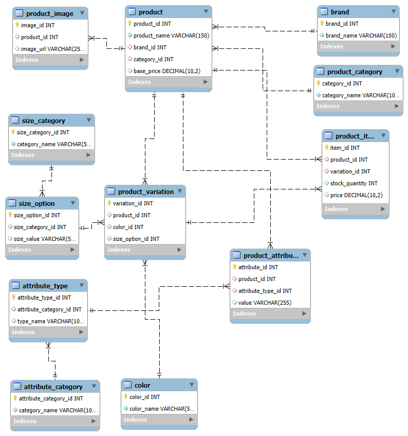

# 🛍️ E-commerce Database Design Project

## 🎯 Objective
This project is part of **Peer Group 19's** database design assignment, aimed at mastering relational database concepts by collaboratively developing a real-world **E-commerce Database** system.

---

## 📐 Overview
We designed a comprehensive Entity-Relationship Diagram (ERD) and implemented the database schema using **MySQL**. This system captures all essential components of an e-commerce platform—from product listings and variations to attributes and stock details.

---

## 🚧 What We Did
- ✅ Designed an intuitive **ERD** with clearly defined entities, relationships, and constraints.
- ✅ Created a detailed **SQL script (`ecommerce.sql`)** to implement the schema.
- ✅ Populated tables with sample data and relevant image URLs.
- ✅ Used **GitHub** for version control and seamless collaboration.

---

## 🗃️ Key Database Tables
| Table | Description |
|-------|-------------|
| `brand` | Stores brand names. |
| `product_category` | Classifies products into categories. |
| `product` | Holds core product details. |
| `product_image` | Stores image URLs for each product. |
| `color` | Lists available product colors. |
| `size_category` | Groups size types (e.g., clothing sizes). |
| `size_option` | Lists specific size values. |
| `product_variation` | Links products to color and size variations. |
| `product_item` | Represents a specific variation in stock. |
| `attribute_category` | Groups product attributes (e.g., tech specs). |
| `attribute_type` | Defines the type of each attribute. |
| `product_attribute` | Stores custom attribute values per product. |

---

## 🖼️ ERD Diagram
A visual representation of the database schema:



---

## 📁 Repository Contents
- `ecommerce.sql` – Full SQL schema creation script
- `Assets/ERD.png` – ER diagram visual
- `README.md` – Project overview and documentation

---

## 👩‍💻 How to Use This Project
1. Clone this repository:
   ```bash
   git clone https://github.com/yourusername/E-Commercedb.git
   ```
2. Open `ecommerce.sql` in MySQL Workbench or any MySQL client.
3. Run the script to create the database and tables.
4. Modify or expand tables as needed.

---

## 🤝 Contributors
We collaborated as a team to bring this project to life. Below are the amazing contributors:

## 👥 Contributors

<table>
  <tr>
    <td align="center" width="25%">
      <a href="https://github.com/amanynabil" target="_blank">
        
        <br /><b>Amany Nabil Ahmed</b>
      </a>
    </td>
    <td align="center" width="25%">
      <a href="https://github.com/nakhanu" target="_blank">
        
        <br /><b>Sophia Nakhanu</b>
      </a>
    </td>
    <td align="center" width="25%">
      <a href="https://github.com/RICCOM" target="_blank">
        
        <br /><b>Eric Munjuri</b>
      </a>
    </td>
    <td align="center" width="25%">
      <a href="https://github.com/stephendavidoduor" target="_blank">
        
        <br /><b>Stephen David Oduor</b>
      </a>
    </td>
  </tr>
</table>
---

## 📌 Notes
- All image URLs used in the database are sourced from [Pexels](https://pexels.com), which provides free high-quality images.
- The project follows MySQL best practices, including key constraints and normalization.

---

## ⭐ Final Thoughts
This project was an incredible learning experience in database design and team collaboration. We are proud to showcase it as a foundational block for any e-commerce application.

> “Alone we can do so little; together we can do so much.” — Helen Keller


- 
